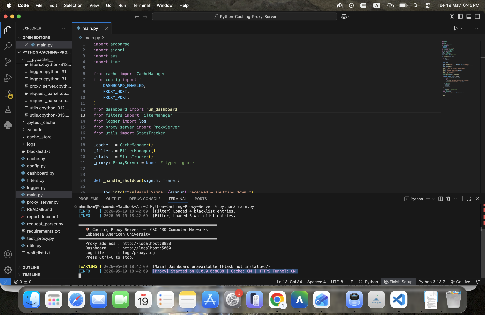
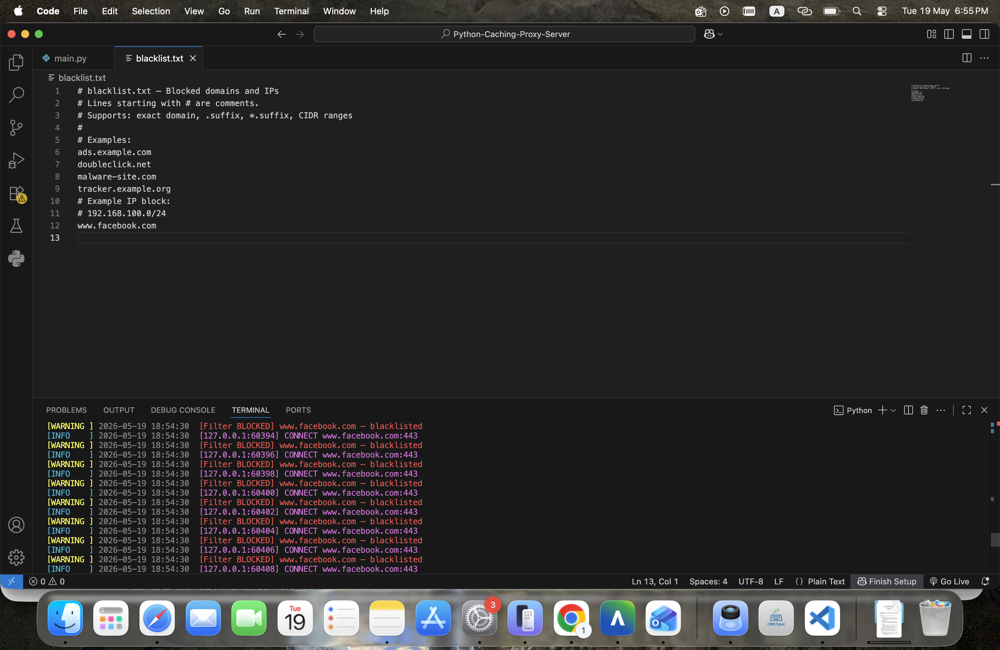
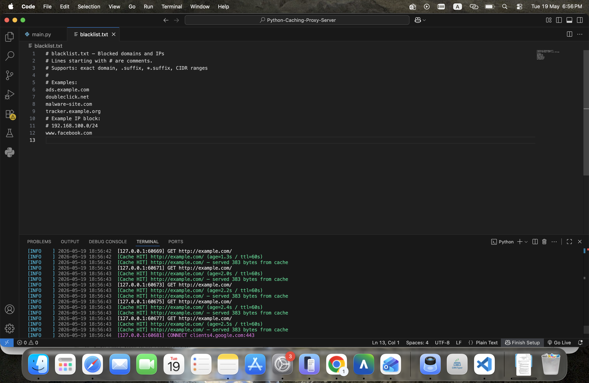

# 🛡 Caching Proxy Server
### CSC 430 — Computer Networks | Lebanese American University

A multithreaded HTTP/HTTPS caching proxy server
Built using Python socket programming

---

## 📁 Project Structure

```
proxy_project/
├── main.py             # Entry point — wires all components
├── proxy_server.py     # Core TCP server + request dispatcher
├── request_parser.py   # HTTP request parsing & header modification
├── cache.py            # LRU cache with TTL + disk persistence
├── filters.py          # Blacklist/whitelist + rate limiting
├── logger.py           # Colored console + rotating file logger
├── dashboard.py        # Flask admin web panel
├── config.py           # All configurable settings
├── utils.py            # Shared helpers, stats tracker
├── test_proxy.py       # Unit + integration tests
├── blacklist.txt        # Blocked domains/IPs
├── whitelist.txt        # Allowed domains (enforced when enabled)
├── requirements.txt
└── logs/proxy.log       # Created automatically
```

---

## ⚡ Quick Start

### 1. Install dependencies

```bash
# Create a virtual environment (recommended)
python -m venv venv

# Windows
venv\Scripts\activate

# Linux / macOS
source venv/bin/activate

# Install Flask (for the dashboard)
pip install -r requirements.txt
```

### 2. Start the proxy

```bash
python main.py
```

Default port: **8888** | Dashboard: **http://localhost:5000**

Custom port:
```bash
python main.py --port 9999
```

Without dashboard:
```bash
python main.py --no-dashboard
```

---

## 🌐 Configure Your Browser

### Firefox
1. Open **Settings → Network Settings → Manual proxy configuration**
2. HTTP Proxy: `127.0.0.1` Port: `8888`
3. Check **"Also use this proxy for HTTPS"**
4. Click OK

### Chrome / Edge (Windows)
```cmd
chrome.exe --proxy-server="http://127.0.0.1:8888"
```

### Chrome / Edge (Linux / macOS)
```bash
google-chrome --proxy-server="http://127.0.0.1:8888"
```

### curl
```bash
curl -x http://127.0.0.1:8888 http://example.com
curl -x http://127.0.0.1:8888 https://httpbin.org/get
```

---

## 📊 Admin Dashboard

Visit **http://localhost:5000** after starting the proxy.

| Route | Description |
|---|---|
| `/stats` | Live statistics (requests, cache hit rate, uptime, top domains) |
| `/cache` | All cached entries with age and TTL |
| `/logs` | Live log viewer (auto-refreshes every 5 seconds) |
| `/blacklist` | View / add / remove blocked domains |
| `/whitelist` | View allowed domains |
| `/api/stats` | JSON API for external monitoring |

---

## ⚙️ Configuration (`config.py`)

| Setting | Default | Description |
|---|---|---|
| `PROXY_PORT` | `8888` | Port to listen on |
| `CACHE_ENABLED` | `True` | Enable/disable caching |
| `CACHE_MAX_SIZE` | `500` | Max LRU cache entries |
| `CACHE_DEFAULT_TTL` | `60` | Fallback TTL in seconds |
| `CACHE_DISK_ENABLED` | `True` | Persist cache to disk |
| `RATE_LIMIT_MAX_REQUESTS` | `100` | Requests per window |
| `RATE_LIMIT_WINDOW` | `60` | Rate limit window (seconds) |
| `WHITELIST_ENABLED` | `False` | Enforce whitelist |
| `HTTPS_TUNNEL_ENABLED` | `True` | Enable CONNECT tunneling |
| `DASHBOARD_PORT` | `5000` | Flask dashboard port |

---

## 🚫 Blacklist / Whitelist

Edit `blacklist.txt` to block domains:
```
ads.example.com
.doubleclick.net        # blocks all subdomains
192.168.100.0/24        # CIDR IP range
```

Edit `whitelist.txt` with allowed domains (only enforced when `WHITELIST_ENABLED = True`).

To reload without restarting — use the dashboard or call `/api/reload` (future feature).

---

## 🧪 Running Tests

```bash
# All tests
python -m pytest test_proxy.py -v

# Unit tests only (no internet required)
python -m pytest test_proxy.py -k "not Integration" -v

# Direct runner
python test_proxy.py
```

---

## 🎬 Demo Guide

1. **Start proxy**: `python main.py`
2. **Configure browser** to use proxy `127.0.0.1:8888`
3. **Open** `http://example.com` — observe terminal logs
4. **Refresh** — observe `[Cache HIT]` log entry
5. **Add** `example.com` to `blacklist.txt`, refresh — see 403 page
6. **Open** `https://httpbin.org/get` — see `[HTTPS TUNNEL]` log
7. **Visit** `http://localhost:5000` — explore the admin dashboard

---

## 🛠 Troubleshooting

| Problem | Solution |
|---|---|
| Port already in use | Change `PROXY_PORT` in `config.py` or use `--port` flag |
| Dashboard not starting | `pip install flask` |
| Browser shows "proxy refused connection" | Ensure `python main.py` is running |
| HTTPS sites not loading | Ensure `HTTPS_TUNNEL_ENABLED = True` in config.py |
| Cache not persisting | Check write permissions on `cache_store/` directory |

---
## Screenshots

### Proxy Server Running


### Blacklist / HTTPS Feature


### Cache System


## 👥 Team Members & Contributions

| Member | Contributions |
|---|---|
| **Hamza** | `config.py`, `request_parser.py`, `cache.py`, `utils.py`, unit tests |
| **Mohamad** | `proxy_server.py`, `filters.py`, `logger.py`, integration tests, HTTPS tunnel |
| **Both** | `main.py`, `dashboard.py`, report, README |

---

## 📚 References

- RFC 7230 — HTTP/1.1 Message Syntax
- RFC 7234 — HTTP/1.1 Caching
- RFC 7231 — HTTP/1.1 Semantics (CONNECT method)
- Python `socket` documentation: https://docs.python.org/3/library/socket.html
- Flask documentation: https://flask.palletsprojects.com
